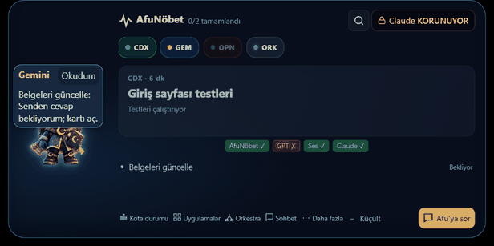
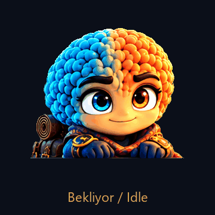

# AfuNobet UI

**A desktop status island and companion for AI coding agents on Windows.**
Afu lives at the top centre of your screen, shows what your agents (Claude Code, Codex, Gemini, OpenCode, GLM and any agent that speaks its protocol) are doing, and tells you when one of them needs you.





[English](#english) · [Türkçe](#türkçe)

---

## English

### What it does

- **Status island** — a small always-on-top card at the top of the screen. It never steals focus, lets clicks pass through its transparent parts and does not appear in Alt-Tab or on the taskbar. Move the mouse to the top edge of the screen and the panel opens; when the mouse leaves, Afu returns to the mini pet.
- **Live agent sessions** — every agent session reported over the local agent pipe is listed with its state: thinking, working, needs approval, done, error or quota wait. Claude Code is connected with hooks; Claude is only *watched*, never given work (the **Claude KORUNUYOR** badge).
- **AfuNobet tasks and quotas** — when the AfuNobet supervisor writes `state.json`, its tasks, agent pills, stages and hand-overs (`Codex quota full → Gemini took over`) are shown. Remaining quotas are read from `.ajan_kota.cache`; stale or unknown values show `-`, never a guess.
- **Questions and approvals** — agents can ask a question; Afu shows a card and writes your answer back.
- **Mini pet** — minimise (or press Esc) and Afu glides down next to the Start button. It greets you when the mouse comes near, sleeps after 5–10 idle minutes, reacts to clicks and makes small expressions every 20–60 s.
- **Tray menu** — right-click the tray icon to pause notifications, show/hide the pet or exit.
- **Ask Afu** — chat from the panel; the request goes through the Codex bridge and you can cancel it at any time.
- **Optional extras** — local push-to-talk speech (Whisper, offline), Windows text-to-speech, GitHub status pill, drag-and-drop file hand-off.

### How it works

```
 Claude Code / Codex / Gemini / OpenCode            AfuNobet supervisor (optional)
        │  hooks                                               │
        ▼                                                      ▼
 scripts/afu_ajan_koprusu.py                          state.json  (+ sorular/, cevaplar/)
        │  one JSON line per event                             │  read-only, directory events
        ▼                                                      ▼
 \\.\pipe\afunobet-ajan-<user>  ──►  Rust core (Tauri 2)  ◄──  watch.rs / state.rs
                                     ipc.rs · protokol.rs
                                           │  Tauri events
                                           ▼
                                TypeScript UI (WebView2)
                                island · card · mini pet · tray
```

1. An agent hook runs `afu_ajan_koprusu.py`, which turns the hook payload into one line of the agent protocol (`docs/AJAN_PROTOKOLU.md`) and writes it to a local named pipe. The bridge always exits 0 and gives up within 0.3 s if Afu is closed, so agents are never slowed down.
2. The Rust core accepts pipe connections **only from the same Windows user**, limits size and rate, masks secrets and paths, and keeps a short session list (finished sessions drop after 10 minutes).
3. It also watches `state.json` through directory events (no polling). A missing or broken file keeps the last good data and shows "Baglanti bekleniyor".
4. The UI merges both sources into one task list and picks the most important task for the card and Afu's expression.

### Project structure

```
windows/
  src/                 TypeScript UI
    core/              state model, agent protocol, labels, bridge to Rust
    island/            island window and its state machine
    afu/               character animation, gestures, expressions, mini pet
    message/ question/ notifications, queue, question cards
    chat/ sor/         chat panel, voice picker, "Ask Afu"
  src-tauri/src/       Rust core
    ipc.rs protokol.rs agent pipe server and event mapping
    state.rs watch.rs  state.json location, reading, watching
    island.rs dpi.rs   window flags, click-through, DPI-safe placement
    glide.rs taskbar.rs yaslanma.rs   mini pet glide and resting place
    tray*.rs           tray icon and menu
    voice/             local speech capture and Whisper
  tests/               Vitest UI tests
scripts/               agent bridge, Claude bridge, fake-data test mode, update script
afu-character/         Afu artwork, cut frames and icons
docs/                  protocol, question contract, test mode, checklists
```

### Install on a new PC

There is no prebuilt installer yet; the app is built from source (about 30 minutes the first time).

1. **Prerequisites** — Node.js 20+, Python 3, WebView2 (built into Windows 11), Rust (`winget install Rustlang.Rustup`) and Visual Studio 2022 Build Tools with the C++, CMake and Clang components:
   ```powershell
   winget install Microsoft.VisualStudio.2022.BuildTools --override "--quiet --wait --norestart --add Microsoft.VisualStudio.Workload.VCTools --add Microsoft.VisualStudio.Component.VC.CMake.Project --add Microsoft.VisualStudio.Component.VC.Llvm.Clang --includeRecommended"
   ```
   Visual Studio **Code** is an editor and is not enough — the C++ compiler comes with Build Tools.
2. **Build and install** — from the repository root:
   ```powershell
   powershell -ExecutionPolicy Bypass -File scripts/gorev-cubugu-guncelle.ps1
   ```
   The script runs `npm ci` if needed, allows the first online dependency download, finds `libclang` in Build Tools, installs the app to `%LOCALAPPDATA%\Programs\AfuNobet-UI`, creates Start menu and desktop shortcuts and, if no supervisor is present, an empty `%LOCALAPPDATA%\AfuNobet\state.json`. Close Afu before building — a running exe is locked ("Access denied").
3. **Pin to the taskbar** — Afu never shows a taskbar button and Windows does not let programs pin themselves. Drag the desktop **AfuNobet UI** shortcut onto the taskbar once. Later updates replace the exe behind it, so the pin always opens the newest version.
4. **Update / roll back** — run the same script after pulling changes; `-GeriAl` restores the previous version.

### Connect Claude Code

Add these hooks to `~/.claude/settings.json` (replace `<repo>` with the repository path) and restart Claude Code:

```json
"hooks": {
  "SessionStart":     [{ "hooks": [{ "type": "command", "command": "python \"<repo>/scripts/afu_ajan_koprusu.py\" --ajan claude", "timeout": 5 }] }],
  "UserPromptSubmit": [{ "hooks": [{ "type": "command", "command": "python \"<repo>/scripts/afu_ajan_koprusu.py\" --ajan claude", "timeout": 5 }] }],
  "PreToolUse":       [{ "hooks": [{ "type": "command", "command": "python \"<repo>/scripts/afu_ajan_koprusu.py\" --ajan claude", "timeout": 5 }] }],
  "PostToolUse":      [{ "hooks": [{ "type": "command", "command": "python \"<repo>/scripts/afu_ajan_koprusu.py\" --ajan claude", "timeout": 5 }] }],
  "Notification":     [{ "hooks": [{ "type": "command", "command": "python \"<repo>/scripts/afu_ajan_koprusu.py\" --ajan claude", "timeout": 5 }] }],
  "Stop":             [{ "hooks": [{ "type": "command", "command": "python \"<repo>/scripts/afu_ajan_koprusu.py\" --ajan claude", "timeout": 5 }] }],
  "SubagentStop":     [{ "hooks": [{ "type": "command", "command": "python \"<repo>/scripts/afu_ajan_koprusu.py\" --ajan claude", "timeout": 5 }] }],
  "SessionEnd":       [{ "hooks": [{ "type": "command", "command": "python \"<repo>/scripts/afu_ajan_koprusu.py\" --ajan claude", "timeout": 5 }] }]
}
```

The session title is the first 120 characters of your prompt; secrets such as tokens and keys are masked. Other agents use the same bridge with `--ajan codex`, `--ajan gemini` and so on.

### Data and privacy

- Agent data stays on your computer: the pipe is local and limited to your Windows user.
- `state.json` is opened read-only. In the data folder Afu writes only your answers (`cevaplar/`) and an `ada_canli` heartbeat, and removes agent messages from `mesajlar/` after showing them; its own settings live in the app data folder.
- Paths, commands, PIDs, ports and secrets are filtered before anything is shown.
- Network is used only by features you turn on (GitHub status through `gh`, Codex sign-in).

### Data location

`AFUNOBET_UI_STATE` (full path to `state.json`) or `AFUNOBET_DB` (same folder) override the default. Otherwise an existing `%USERPROFILE%\Desktop\afuproject\AfuNobet` is used, else `%LOCALAPPDATA%\AfuNobet`. `AFUNOBET_AJAN_PIPE` changes the pipe name for tests.

### Development

Working directory: `windows`.

```powershell
npm test                 # Vitest UI tests
npm run build            # type check + bundle
cargo test --release     # Rust tests
```

Screenshot tests need the Playwright browser (`npx playwright install chromium-headless-shell`); if they time out on a busy machine, run them with `--no-file-parallelism`. For a fake-data run without real agents see `docs/SAHTE_TEST_MODU.md`. Change history: `CHANGELOG.md` and `AFU_CHANGES.md`. Local release builds record the dated EXE and its SHA256 in `dist/uiux-build-manifest.json`; build output is never committed.

If a Rust voice test fails only on your machine, check `python.exe`: the Microsoft Store / install-manager launcher starts the real interpreter as a child process.

---

## Türkçe

### Ne işe yarar

- **Durum adası** — ekranın üstünde, her zaman en üstte duran küçük bir kart. Odağı çalmaz, saydam kısımlarından tıklama geçirir, Alt-Tab'da ve görev çubuğunda görünmez. Fareyi ekranın üst kenarına getirince panel açılır; fare ayrılınca Afu mini pete döner.
- **Canlı ajan oturumları** — yerel ajan borusundan bildirilen her ajan oturumu durumuyla listelenir: düşünüyor, çalışıyor, onay bekliyor, bitti, hata ya da kota bekliyor. Claude Code kancalarla bağlanır; Claude yalnızca *izlenir*, ona iş verilmez (**Claude KORUNUYOR** rozeti).
- **AfuNöbet görevleri ve kotalar** — AfuNöbet gözetmeni `state.json` yazıyorsa görevleri, ajan sekmeleri, aşamalar ve devirler (`Codex kotası doldu → Gemini devraldı`) gösterilir. Kalan kotalar `.ajan_kota.cache` dosyasından okunur; bayat ya da bilinmeyen değer `-` gösterilir, tahmin üretilmez.
- **Sorular ve onaylar** — ajanlar soru sorabilir; Afu kart açar ve cevabını geri yazar.
- **Mini pet** — küçültünce (ya da Esc) Afu süzülerek Başlat düğmesinin yanına iner. Fare yaklaşınca selam verir, 5–10 dakika boşta uyur, tıklamalara tepki verir, 20–60 sn'de bir küçük ifadeler yapar.
- **Tepsi menüsü** — tepsi simgesine sağ tıklayıp bildirimleri duraklatın, peti gösterin/gizleyin ya da çıkın.
- **Afu'ya sor** — panelden sohbet; istek Codex köprüsüyle gider, istediğiniz an iptal edebilirsiniz.
- **İsteğe bağlı** — yerel bas-konuş (Whisper, çevrimdışı), Windows sesli okuma, GitHub durum sekmesi, sürükle-bırak dosya iletme.

### Nasıl çalışır

Yukarıdaki çizim iki veri yolunu gösterir:

1. Ajan kancası `afu_ajan_koprusu.py`'yi çalıştırır; köprü kanca verisini ajan protokolünün (`docs/AJAN_PROTOKOLU.md`) tek satırına çevirip yerel adlandırılmış boruya yazar. Köprü her zaman 0 ile çıkar, Afu kapalıysa en geç 0,3 sn'de vazgeçer; ajanlar yavaşlamaz.
2. Rust çekirdeği boru bağlantısını **yalnız aynı Windows kullanıcısından** kabul eder, boyut ve hız sınırlar, gizli bilgi ve yolları maskeler, kısa bir oturum listesi tutar (biten oturumlar 10 dakika sonra düşer).
3. `state.json`'u dizin olaylarıyla izler (periyodik kontrol yok). Eksik ya da bozuk dosyada son geçerli veri korunur, "Bağlantı bekleniyor" gösterilir.
4. Arayüz iki kaynağı tek görev listesinde birleştirir; kart ve Afu'nun ifadesi için en önemli görevi seçer.

### Proje yapısı

Klasör ağacı İngilizce bölümdedir. Kısaca: `windows/src` TypeScript arayüzü (durum modeli, ada, karakter, bildirim, soru, sohbet), `windows/src-tauri/src` Rust çekirdeği (boru sunucusu, durum dosyası, pencere bayrakları, mini pet, tepsi, ses), `scripts` köprüler ve betikler, `afu-character` Afu çizimleri, `docs` sözleşmeler ve kontrol listeleri.

### Yeni bilgisayarda kurulum

Henüz hazır kurulum dosyası yoktur; uygulama kaynaktan derlenir (ilk sefer yaklaşık 30 dakika).

1. **Gereksinimler** — Node.js 20+, Python 3, WebView2 (Windows 11'de hazır), Rust (`winget install Rustlang.Rustup`) ve C++, CMake ve Clang bileşenleriyle Visual Studio 2022 Build Tools (komut yukarıda). Visual Studio **Code** bir editördür, yetmez — C++ derleyicisi Build Tools ile gelir.
2. **Derle ve kur** — depo kökünden `powershell -ExecutionPolicy Bypass -File scripts/gorev-cubugu-guncelle.ps1`. Betik gerekirse `npm ci` çalıştırır, ilk çevrimiçi bağımlılık indirmesine izin verir, `libclang`'ı Build Tools içinde bulur, uygulamayı `%LOCALAPPDATA%\Programs\AfuNobet-UI` altına kurar, Başlat menüsü ve masaüstü kısayolu oluşturur; gözetmen yoksa boş bir `%LOCALAPPDATA%\AfuNobet\state.json` yazar. Derlemeden önce Afu'yu kapatın — çalışan exe kilitlidir ("Erişim engellendi").
3. **Görev çubuğuna sabitle** — Afu görev çubuğunda düğme göstermez, Windows da programların kendini sabitlemesine izin vermez. Masaüstündeki **AfuNobet UI** kısayolunu bir kez görev çubuğuna sürükleyin. Sonraki güncellemeler arkasındaki exe'yi değiştirir; sabitlenen simge hep en yeni sürümü açar.
4. **Güncelle / geri al** — değişiklikleri çektikten sonra aynı betiği çalıştırın; `-GeriAl` önceki sürüme döner.

### Claude Code'u bağla

İngilizce bölümdeki `hooks` bloğunu `~/.claude/settings.json` dosyasına ekleyin (`<repo>` yerine depo yolunu yazın) ve Claude Code'u yeniden başlatın. Oturum başlığı isteminizin ilk 120 karakteridir; anahtar ve token gibi gizli bilgiler maskelenir. Diğer ajanlar aynı köprüyü `--ajan codex`, `--ajan gemini` gibi kullanır.

### Veri ve gizlilik

- Ajan verisi bilgisayarınızda kalır: boru yereldir ve yalnız sizin Windows kullanıcınıza açıktır.
- `state.json` salt okunur açılır. Veri klasörüne Afu yalnız cevaplarınızı (`cevaplar/`) ve `ada_canli` canlılık dosyasını yazar; `mesajlar/` içindeki ajan mesajlarını gösterdikten sonra siler. Kendi ayarları uygulama veri klasöründe durur.
- Yol, komut, PID, port ve gizli bilgiler gösterilmeden önce süzülür.
- Ağ yalnız açtığınız özelliklerce kullanılır (`gh` ile GitHub durumu, Codex girişi).

### Veri yeri

`AFUNOBET_UI_STATE` (`state.json` tam yolu) ya da `AFUNOBET_DB` (aynı klasör) varsayılanı geçersiz kılar. Yoksa mevcut `%USERPROFILE%\Desktop\afuproject\AfuNobet`, o da yoksa `%LOCALAPPDATA%\AfuNobet` kullanılır. `AFUNOBET_AJAN_PIPE` testler için boru adını değiştirir.

### Geliştirme

Çalışma dizini `windows`: `npm test` (arayüz testleri), `npm run build` (tip denetimi + paket), `cargo test --release` (Rust testleri). Ekran görüntüsü testleri Playwright tarayıcısı ister (`npx playwright install chromium-headless-shell`); yoğun makinede zaman aşımı olursa `--no-file-parallelism` ile çalıştırın. Gerçek ajan olmadan sahte veriyle deneme için `docs/SAHTE_TEST_MODU.md`. Değişiklik geçmişi: `CHANGELOG.md` ve `AFU_CHANGES.md`. Yerel teslim derlemeleri tarihli EXE'yi ve SHA256 değerini `dist/uiux-build-manifest.json` içinde kaydeder; derleme çıktısı depoya eklenmez.

Bir Rust ses testi yalnız sizin makinenizde kalıyorsa `python.exe`'yi kontrol edin: Microsoft Store / yükleme yöneticisi başlatıcısı asıl yorumlayıcıyı alt süreç olarak başlatır.

---

## License / Lisans

MIT — see [LICENSE](LICENSE), [LICENSE-ASSETS.md](LICENSE-ASSETS.md) (Afu artwork) and [THIRD_PARTY.md](THIRD_PARTY.md).
MIT — bkz. [LICENSE](LICENSE), [LICENSE-ASSETS.md](LICENSE-ASSETS.md) (Afu çizimleri) ve [THIRD_PARTY.md](THIRD_PARTY.md).
