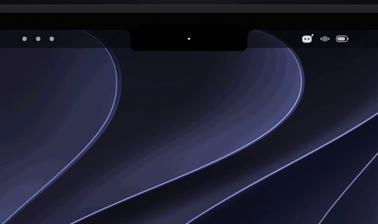
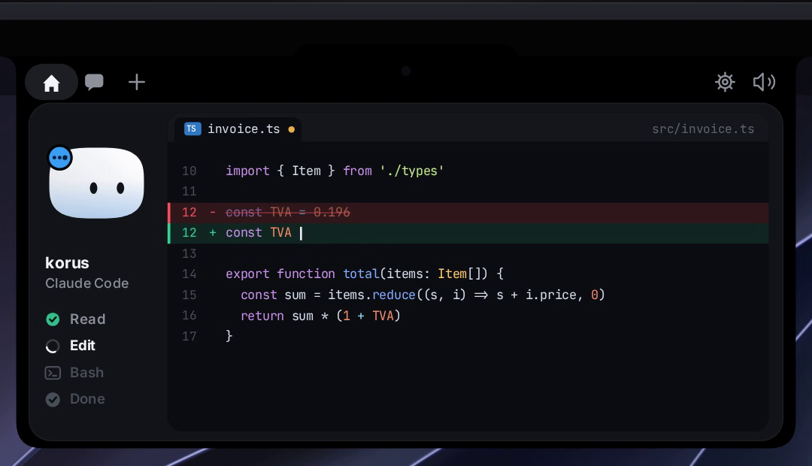
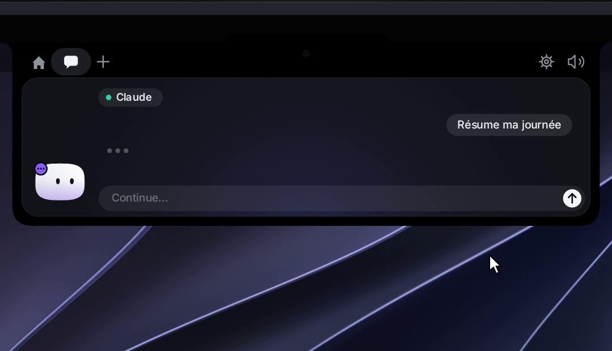
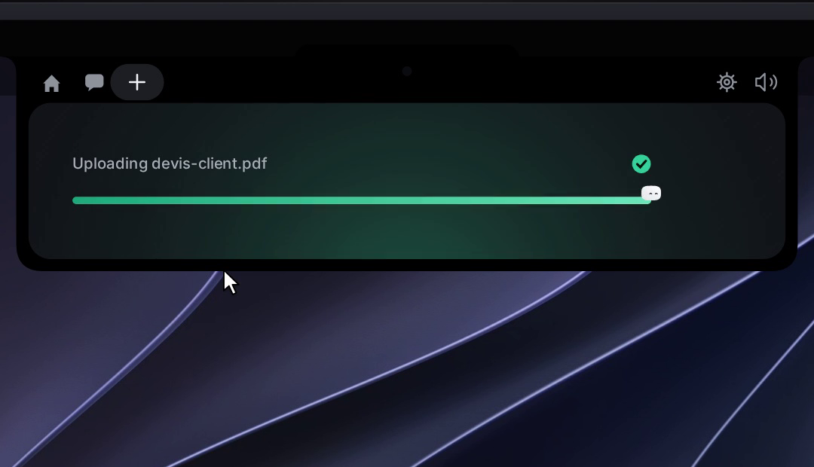
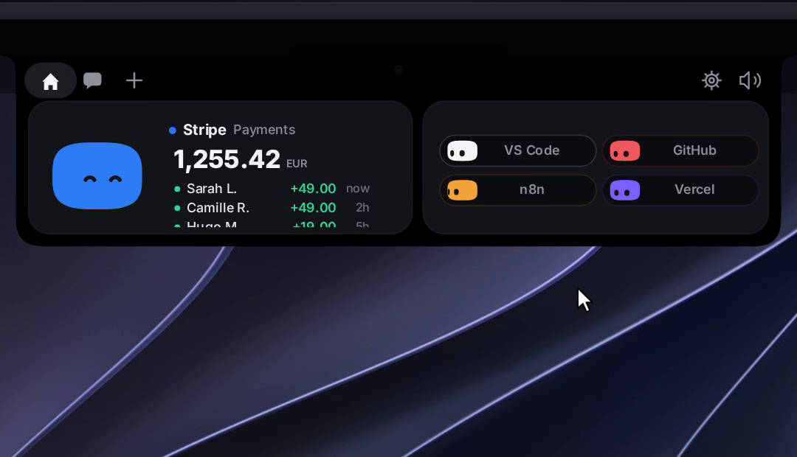
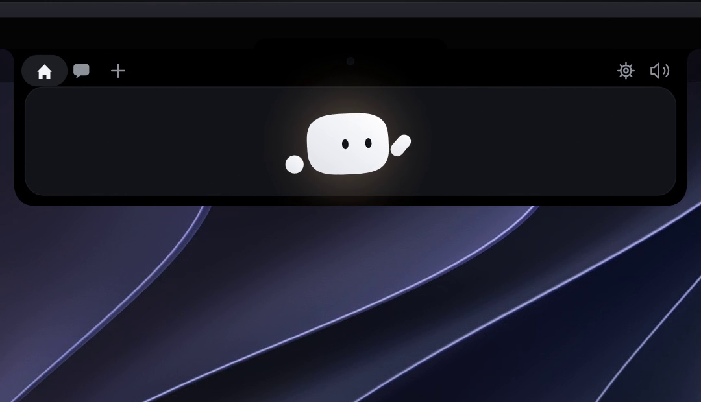
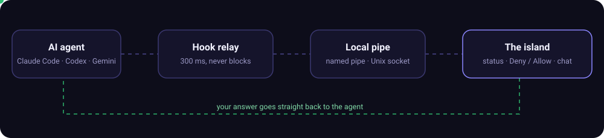

<div align="center">


<br>

[](LICENSE)
[](https://github.com/Louis-CFM/coucou)
[](windows/)
[](NotchBuddy/)
[](windows/src-tauri/)

**[English](#-english)** · **[Türkçe](#-türkçe)**

</div>

<p align="center">
  
</p>

---

## 🇬🇧 English

A small island at the top of your screen that watches your AI coding agents (**Claude Code, Codex, Cursor, Gemini CLI, Antigravity** and more). It lets you **approve permissions, answer questions, chat and drop files** without leaving what you're doing. On a MacBook it lives in the notch. On Windows and Linux it slides down from the top edge.

> [!NOTE]
> This repository is built on **[Coucou](https://github.com/Louis-CFM/coucou)** by Louis Raillé. The source code is MIT. The names *Coucou* and *Mochi*, the Mochi character, the icons, the sounds and the media in `docs/media/` and `design/` belong to Louis Raillé. See [LICENSE-ASSETS.md](LICENSE-ASSETS.md).

### ✨ What it does

<table>
  <tr>
    <td width="50%" valign="top">
      
      <h4>👀 Live agent sessions</h4>
      Every step (Read, Edit, Bash, Done) appears as it happens. File edits show their <code>+N −M</code> lines, and a click opens the diff.
    </td>
    <td width="50%" valign="top">
      
      <h4>💬 Chat from the island</h4>
      Anthropic, Google AI, OpenAI, or local models through Ollama / LM Studio. Answers stream in with Markdown and code blocks.
    </td>
  </tr>
  <tr>
    <td width="50%" valign="top">
      
      <h4>📦 Drop a file</h4>
      Drag a file onto the island. It turns into a box, swallows the file, then offers to answer questions about it.
    </td>
    <td width="50%" valign="top">
      
      <h4>🔌 Integrations</h4>
      Stripe, GitHub (PRs, CI, review requests), Vercel, n8n, Resend, Notion and Cal.com, each one in its own pill.
    </td>
  </tr>
  <tr>
    <td width="50%" valign="top">
      
      <h4>👋 A character with moods</h4>
      It breathes, blinks, follows your cursor, dances to your music and dresses up for the seasons.
    </td>
    <td width="50%" valign="top">
      
      <h4>😵 Don't poke it too much</h4>
      Click it and it gets annoyed. Click it three times in a row and it goes dizzy. Rest the pointer on it for hearts.
    </td>
  </tr>
</table>

### ⚙️ How it works

<p align="center">
  
</p>

- The hook relay gets **300 ms** to reach the app. If the app is closed, slow or has crashed, it exits right away, so **an agent session is never blocked**.
- Nothing is approved without **your explicit click**.
- `~/.claude/settings.json` is never overwritten: you see a dated backup and the exact diff, and nothing is written until you confirm.
- Keys live in the **Keychain / Windows Credential Manager / Secret Service**, never on disk. No telemetry: the only network calls go to services you configure yourself.

### 🖥️ Platforms

| Platform | Folder | How it looks | Status |
|---|---|---|---|
| **macOS 15+** | [`NotchBuddy/`](NotchBuddy/) | Lives in the notch (a small bar on Macs without one) | Native Swift app |
| **Windows 10/11** | [`windows/`](windows/) | Slides down from the top-centre of the screen | Build from source ([why](windows/README.md#install)) |
| **Linux** | [`windows/`](windows/) | gtk-layer-shell overlay (regular window on GNOME) | Beta: AppImage, .deb, .rpm |

<p align="center">
  <br>
  <sub>Windows: a Claude Code permission request, answered from the island</sub>
</p>

### 🚀 Quick start

<details open>
<summary><b>Windows / Linux</b>: Rust, Node 20+ and the MSVC build tools on Windows</summary>

```powershell
cd windows
npm install
npm run tauri dev      # live-reloading development build
npm run pack           # installer in windows/release/
```

Then open **Settings… → Claude Code → Install hooks…**. All the details are in [windows/README.md](windows/README.md).
</details>

<details>
<summary><b>macOS</b>: Xcode and XcodeGen</summary>

```bash
cd NotchBuddy && xcodegen && xcodebuild -scheme NotchBuddy -configuration Debug build
```
</details>

### 🗂️ Repository map

```
NotchBuddy/   native macOS app (Swift 6, SwiftUI + AppKit)
windows/      Tauri 2 app for Windows and Linux (Rust + TypeScript)
  hook/         the Claude Code relay (coucou-hook)
docs/         SPEC, INTEGRATIONS, AGENTS, the website and media
design/       original prototype and target screenshots
```

### 🏷️ Versions

| Version | Date | Highlights |
|---|---|---|
| [0.1.7](CHANGELOG.md#017--october-4-2026) | Oct 4, 2026 | Global keyboard shortcuts, configurable in Settings → Shortcuts |
| [0.1.6](CHANGELOG.md#016--october-4-2026) | Oct 4, 2026 | Drag the character out to the desktop; it flies back when Claude needs you |
| [0.1.5](CHANGELOG.md#015--october-4-2026) | Oct 4, 2026 | Wardrobe and seasonal outfits, new launch greeting |
| [0.1.4](CHANGELOG.md#014--october-3-2026) | Oct 3, 2026 | Live file diffs, GitHub PR/CI pill and alerts |
| [0.1.3](CHANGELOG.md#013--october-3-2026) | Oct 3, 2026 | Answer Claude's questions from the island, local models, plan usage |
| [0.1.2](CHANGELOG.md#012--october-2-2026) | Oct 2, 2026 | Codex and Cursor support |
| [0.1.1](CHANGELOG.md#011--october-2-2026) | Oct 2, 2026 | Linux build, Gemini / OpenAI chat, any agent can get its own pill |
| [0.1.0](CHANGELOG.md#010--september-27-2026) | Sep 27, 2026 | First release |

### 🙌 Credits & license

- **Coucou** and **Mochi** were created by [Louis Raillé](https://github.com/Louis-CFM), with contributions from @lacatu5, @Davy133, @Kamasoutra, @Cris1670, @Vignesh-Thangamariappan, @rouderz, @MysJofR, @corefusiion and others (see [CHANGELOG.md](CHANGELOG.md)).
- Code: [MIT](LICENSE). Name, character, icons, sounds and media: [LICENSE-ASSETS.md](LICENSE-ASSETS.md). They may be shown and discussed, but not shipped in your own app without written permission.
- Want to help? Read [CONTRIBUTING.md](CONTRIBUTING.md).

---

## 🇹🇷 Türkçe

Ekranın üstünde duran küçük bir **ada**. Yapay zekâ kodlama ajanlarını (**Claude Code, Codex, Cursor, Gemini CLI, Antigravity** ve fazlası) izler. İşini bırakmadan **izin onaylamanı, sorulara cevap vermeni, sohbet etmeni ve dosya bırakmanı** sağlar. MacBook'ta çentiğin (notch) içinde yaşar. Windows ve Linux'ta ekranın üst kenarından aşağı kayar.

> [!NOTE]
> Bu depo, Louis Raillé'nin **[Coucou](https://github.com/Louis-CFM/coucou)** projesi üzerine kuruludur. Kaynak kod MIT lisanslıdır. *Coucou* ve *Mochi* adları, Mochi karakteri, simgeler, sesler ve `docs/media/` ile `design/` içindeki görseller Louis Raillé'ye aittir. Ayrıntılar için [LICENSE-ASSETS.md](LICENSE-ASSETS.md) dosyasına bak.

### ✨ Neler yapar

| | |
|---|---|
| 👀 **Canlı ajan oturumları** | Her adım (Read, Edit, Bash, Done) anında görünür. Dosya düzenlemeleri `+N −M` satır olarak gösterilir, tıklayınca fark (diff) açılır. |
| ✅ **İzin ve sorular** | Claude Code ile Codex'in izin isteklerine adadan **Reddet / İzin ver** dersin. Çoktan seçmeli sorulara da oradan cevap verirsin. |
| 💬 **Sohbet** | Anthropic, Google AI, OpenAI ya da Ollama / LM Studio üzerinden yerel modellerle konuşabilirsin. |
| 📦 **Dosya bırak** | Dosyayı adaya sürükle. Karakter kutuya dönüşüp dosyayı yutar, sonra dosya hakkında soru sormanı teklif eder. |
| 🔌 **Entegrasyonlar** | Stripe, GitHub (PR, CI, inceleme istekleri), Vercel, n8n, Resend, Notion ve Cal.com. Her biri kendi hapında görünür. |
| 👋 **Karakter** | Nefes alır, göz kırpar, imleci takip eder, müziğe dans eder, mevsime göre giyinir. Üç kez tıklarsan başı döner. |

### ⚙️ Nasıl çalışır

- Ajanın hook'u küçük bir aktarıcıyı çalıştırır. Aktarıcı, yerel boru (Windows'ta named pipe, Linux/macOS'ta Unix soketi) üzerinden adaya ulaşmak için **300 ms** bekler. Uygulama kapalıysa ya da donmuşsa hemen çıkar, yani **ajan oturumu asla bloklanmaz**.
- Senin **açık tıklaman** olmadan hiçbir şey onaylanmaz.
- `~/.claude/settings.json` hiçbir zaman ezilmez: tarihli yedeği ve değişikliğin tam farkını görürsün, sen onaylamadan hiçbir şey yazılmaz.
- Anahtarlar **Keychain / Windows Kimlik Bilgisi Yöneticisi / Secret Service** içinde tutulur, diske yazılmaz. Telemetri yoktur. Ağ istekleri yalnızca senin ayarladığın servislere gider.

### 🚀 Hızlı başlangıç

**Windows / Linux:** Rust, Node 20+ ve Windows'ta MSVC derleme araçları gerekir.

```powershell
cd windows
npm install
npm run tauri dev      # canlı yenilenen geliştirme sürümü
npm run pack           # kurulum dosyası windows/release/ içine
```

Sonra **Settings… → Claude Code → Install hooks…** adımını izle. Windows için hazır kurulum dosyası şu an yayında değil, çünkü Microsoft Defender imzasız kurulumu yanlışlıkla zararlı olarak işaretliyor. Bu yüzden kaynaktan derlemek gerekiyor ([ayrıntı](windows/README.md#install)).

**macOS:** `cd NotchBuddy && xcodegen && xcodebuild -scheme NotchBuddy -configuration Debug build`

### 🙌 Emeği geçenler ve lisans

Coucou ve Mochi'yi [Louis Raillé](https://github.com/Louis-CFM) yarattı, topluluk da katkı verdi (bkz. [CHANGELOG.md](CHANGELOG.md)). Kod [MIT](LICENSE) lisanslıdır. Ad, karakter, simge, ses ve görseller [LICENSE-ASSETS.md](LICENSE-ASSETS.md) kapsamındadır: gösterilebilir ve hakkında yazılabilir, ama yazılı izin olmadan kendi uygulamanda dağıtılamaz.

<p align="center"><sub>Made with care for people who'd rather not babysit a terminal.</sub></p>
